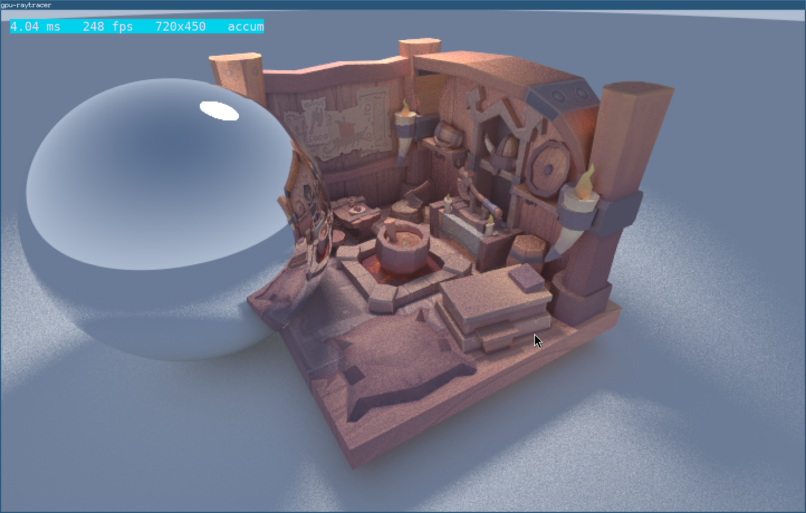

# gpu-raytracer

GPU-native educational raytracer. `raytrace-rs` is the CPU-side reference for scene ideas and rendering intent, but this repo stays compute/GPU-oriented rather than mirroring the CPU architecture directly.

This project is at a good stopping point as a learning tool. It demonstrates the core architectural shift from CPU raytracing to GPU raytracing without turning into a full engine.



## Current State

- CMake + Ninja build
- Clang toolchain
- Vendored SDL3 through CMake `FetchContent`
- Vendored SDL3_ttf for native-resolution text overlay
- SDL3 floating window on X11/i3
- Vulkan swapchain + compute shader raytracing path
- Flat triangle BVH and packed GPU scene buffers
- Proper material buffer plus texture sampling
- Classic deterministic mode and accumulated stochastic mode
- Sphere scene plus textured OBJ mesh path
- VS Code `F5` build + launch flow

## What It Teaches

- how CPU-side scene data gets packed for GPU consumption
- how Vulkan compute dispatch drives a raytracing kernel
- how accumulation changes a stable raytracer into a noisy progressive path tracer
- how BVHs, materials, textures, and presentation fit into a small GPU renderer
- where this kind of renderer differs from hybrid game rendering

## Build

```bash
cmake --preset debug
cmake --build --preset debug
./build/debug/gpu-raytracer
```

## VS Code

Open the `gpu-raytracer` folder and press `F5`.

That runs the `build` task, then launches `build/debug/gpu-raytracer` under `gdb`.

## Controls

- `Right Mouse`: hold to capture mouse and look around
- `W A S D`: move
- `Space` / `Shift`: move up / down
- `F1`: full internal resolution
- `F2`: half internal resolution
- `F3`: quarter internal resolution
- `F4`: toggle `classic` / `accum` lighting mode
- `Escape`: quit

## Docs

- `docs/current-renderer-walkthrough.md`: current Vulkan + shader architecture
- `docs/roadmap.md`: renderer milestone order
- `docs/hybrid-rendering-notes.md`: G-buffer and hybrid raster + raytrace ideas
- `docs/lightmap-baking-notes.md`: how this codebase could grow into a lightmap baker
- `docs/bake-volume-notes.md`: how a practical region-scoped bake workflow could work
- `docs/packing-notes.md`: where tighter GPU packing matters and where it does not

## Status

As an educational renderer, this is a solid endpoint:

- movable camera
- Vulkan compute raytracing
- classic and accumulation modes
- textures, materials, OBJ loading, and BVH traversal
- enough docs to explain the architecture and likely next branches

If this ever continues, the natural directions are either hybrid rendering or offline-style baking, but neither is required for this repo to feel complete.
